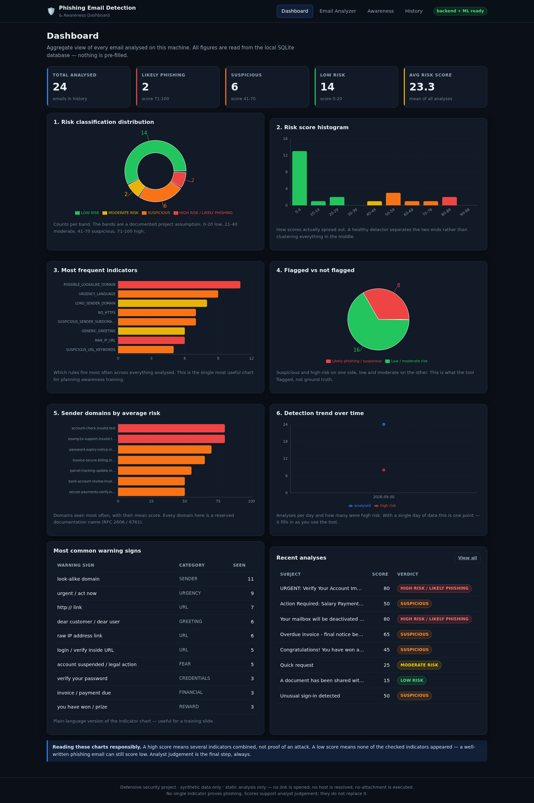
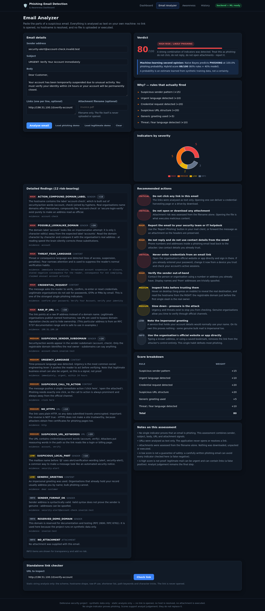
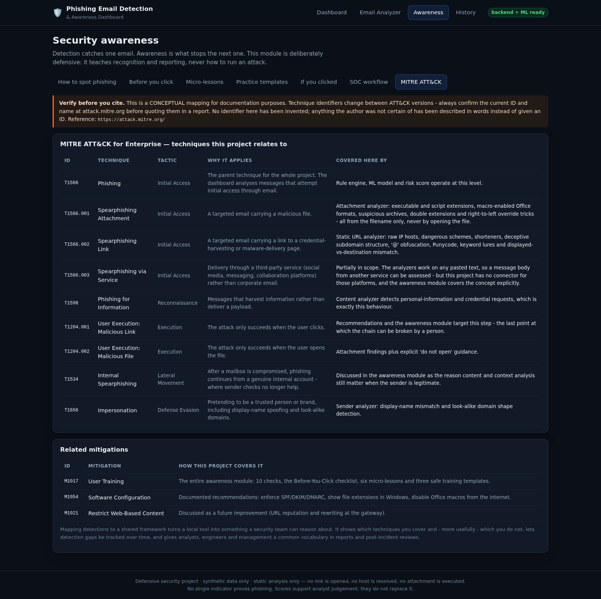
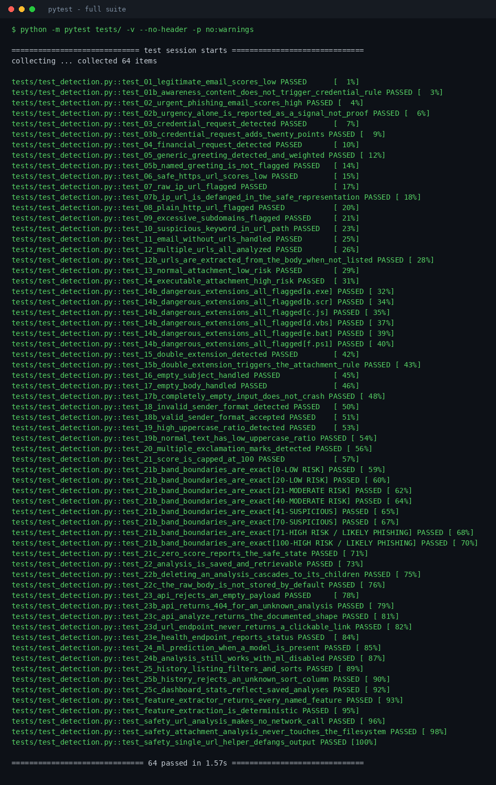

# Phishing Email Detection & Awareness Dashboard

A defensive, fully offline security tool that analyses an email for phishing
indicators, **explains every point it awards**, and teaches the reader how to
recognise the next one.

> Every number in this README was produced by running the code in this
> repository. Nothing is estimated, rounded up, or copied from a tutorial.
> The commands that generated each figure are listed next to it.

---

## Overview

Paste a suspicious email into the dashboard and you get three things back:

1. **A risk score out of 100** built from seven transparent, weighted rules.
2. **A "Why?" list** naming every rule that fired and the evidence behind it.
3. **Prioritised actions** — what to do now, written for a non-specialist.

A machine-learning model trained on the project's own synthetic dataset gives a
second opinion, and a hybrid score blends the two. Everything runs locally:
no cloud service, no API key, no account.

**The tool never opens a link, never resolves a hostname, and never executes an
attachment.** URL analysis is static string analysis; attachment analysis reads
the filename only.

---

## Problem Statement

Phishing remains the most common way attackers get their first foothold, and it
succeeds for human reasons rather than technical ones: urgency, fear, authority
and habit. Two gaps make it worse:

- **Commercial filters are black boxes.** They output "spam" or "not spam" with
  no reasoning, so the user learns nothing and cannot challenge a wrong verdict.
- **Awareness training is disconnected from tooling.** Staff attend a session,
  then go back to an inbox that gives them no help applying it.

This project closes both gaps: a detector that must justify every point it
awards, sitting inside the awareness material that explains what those points
mean.

---

## Objectives

1. Detect phishing indicators across **five independent surfaces** — sender,
   subject, body, URLs and attachment filename.
2. Produce a 0–100 risk score from **documented, auditable weights**.
3. Explain **every** verdict in plain language, with the evidence quoted.
4. Compare rule-based, machine-learning and hybrid detection **on the same
   held-out test split** and report what actually happened.
5. Teach the warning signs through an integrated awareness module.
6. Stay strictly defensive and run on a normal laptop with no paid services.

---

## Features

| Area | What it does |
|---|---|
| **Sender analysis** | Format validity, look-alike domains by edit distance, action-word compounds (`account-check`), digit substitution (`examp1e`), subdomain depth, display-name mismatch |
| **Content analysis** | Urgency, threat/fear, credential requests, financial pressure, reward bait, generic greetings, shouting, punctuation abuse, grammar anomalies, active HTML |
| **URL analysis** | Raw-IP links, missing HTTPS, shorteners, excessive subdomains, credential keywords in the path, `@` tricks, punycode, over-long URLs — **all static** |
| **Attachment analysis** | Executable/script/macro extensions, double extensions, archive types — **filename only** |
| **Risk engine** | Seven weighted rules, capped 0–100, four documented bands |
| **Explainability** | A "Why?" list plus per-indicator severity, category, evidence and weight |
| **Machine learning** | TF-IDF + 39 structured features; Logistic Regression, Naive Bayes, Random Forest; model chosen by validation F1 |
| **Hybrid scoring** | Weighted blend (60% rules / 40% model), configurable |
| **Dashboard** | 5 summary cards, 6 charts, searchable history, full stored reports |
| **Awareness module** | 10 spotting techniques, 10-point checklist, 6 micro-lessons, 3 safe practice templates, incident playbook, SOC workflow, MITRE ATT&CK mapping |
| **History** | Search, filter by band, filter by minimum score, sort any column, view, delete |
| **API** | FastAPI with automatic Swagger docs at `/docs` |
| **Safety** | Defanged URLs (`hxxp://198[.]51[.]100[.]10`), body not stored by default, tests that fail if a network call is ever added |

---

## Cybersecurity Relevance

This project maps onto work a real security team does:

- **Tier-1 SOC triage.** A reported email needs a fast, consistent first pass
  that highlights indicators and produces a written justification. That is
  exactly what `/api/analyze` returns.
- **Explainability as a requirement, not a nicety.** An analyst who cannot say
  *why* something was blocked cannot defend the decision to a user, a manager,
  or an auditor. Every score here decomposes into named rules.
- **Precision over recall at the escalation threshold.** Measured on the test
  split, the rule engine produces **0 false positives out of 47 legitimate
  emails**. A filter that cries wolf gets ignored, and an ignored filter
  protects nobody.
- **Knowing the limits.** The same measurement shows **12 false negatives**,
  eleven of them business-email-compromise messages with no surface indicators
  whatsoever. That result is reported prominently rather than hidden, because
  it is the argument for header authentication and out-of-band verification.
- **MITRE ATT&CK vocabulary.** Findings are related to T1566 and its
  sub-techniques so the output fits an existing reporting framework.

---

## Architecture

```
Email input (sender, subject, body, URLs, attachment filename)
        |
        v
  Preprocessing ......... normalise, strip control chars, extract URLs
        |
        +---> Sender analyzer ........ analyze_sender()
        +---> Content analyzer ....... analyze_email_content()
        +---> URL analyzer ........... analyze_url()      [STATIC ONLY]
        +---> Attachment analyzer .... analyze_attachment() [FILENAME ONLY]
        |
        v
  Feature extraction .... extract_email_features()  -> 39 features
        |
        +----------------------------+
        v                            v
  Rule-based engine            ML model
  calculate_phishing_score()   TF-IDF + classifier
        |                            |
        +------------+---------------+
                     v
              Hybrid score (60% rules / 40% model)
                     |
                     v
        Risk score 0-100  ->  Classification band
                     |
                     v
        Explainable findings + prioritised recommendations
                     |
                     v
          SQLite (analyses / indicators / url_analyses)
                     |
                     v
        FastAPI  ->  React dashboard  ->  Awareness module
```

Rendered diagram: [`docs/architecture_diagram.svg`](docs/architecture_diagram.svg)
· full module map and data contracts: [`docs/ARCHITECTURE.md`](docs/ARCHITECTURE.md)

---

## Technology Stack

| Layer | Choice | Why this one |
|---|---|---|
| Language | Python 3.10+ | Standard for security tooling and ML |
| API | FastAPI + Uvicorn | Automatic OpenAPI docs; typed validation |
| Validation | Pydantic v2 | Rejects malformed input at the boundary |
| Database | SQLite | Zero setup, single file, ships with Python |
| ML | scikit-learn | Trains in ~1 s, reproducible, inspectable |
| Charts (backend) | matplotlib | Writes the metric PNGs |
| Frontend | React 18 + Vite | Fast dev server, simple build |
| Charts (frontend) | Recharts | Declarative charts that fit React |
| Testing | pytest | 64 tests covering the 25 required scenarios |

**Deliberately avoided:** paid APIs, cloud services, GPU-only models, heavyweight
CSS frameworks. The project must run on a student laptop, offline.

---

## Dataset

Generated by [`data/generate_dataset.py`](data/generate_dataset.py) — deterministic
for a given seed.

```
python data/generate_dataset.py
```

| Property | Value |
|---|---|
| Rows | 600 |
| PHISHING | 288 (48.0%) |
| LEGITIMATE | 312 |
| Rows with URLs | 338 |
| Rows with attachments | 433 |
| Unique sender domains | 36 |
| Average body length | 248.2 characters |
| Seed | 42 |

**Columns:** `email_id, sender, sender_domain, subject, body, urls, attachment_name, label`

### Composition — and why it is built this way

| Kind | Share of each class | Purpose |
|---|---|---|
| Clear-cut | ~71% | Obvious lures and obviously benign mail |
| Hard | 20% | Urgent-but-genuine mail; quiet business-email compromise |
| **Indistinguishable** | **9%** | **Drawn from a shared template pool used by BOTH labels** |

The indistinguishable rows are deliberate. Whether "please process invoice 4821"
is legitimate depends on whether that invoice exists — a fact that lives in the
accounting system, not in the email. Including these rows gives the dataset a
realistic **irreducible error floor**.

Without them the models score a perfect 1.0000 on every metric, which looks
fabricated, teaches nothing, and hides the real lesson. With them the evaluation
produces genuine false positives and false negatives, so the analysis below
describes measured behaviour instead of a hypothetical.

**Safety:** every domain is reserved by RFC 2606 / RFC 6761
(`example.com`, `example.org`, `example.net`, `*.invalid.test`) and every IP is
from the RFC 5737 documentation ranges (`192.0.2.x`, `198.51.100.x`,
`203.0.113.x`). No real person, company, brand or address appears anywhere.

---

## Phishing Indicators

Seven rules carry weight. Everything else is reported as context and adds nothing.

| Rule | Weight | Fires when |
|---|---|---|
| Suspicious sender | **+15** | Sender risk sub-score ≥ 30 |
| Urgency language | **+10** | Time-pressure phrasing detected |
| Credential request | **+20** | Message asks for a password, OTP, PIN or login |
| Suspicious URL | **+20** | Any link's risk sub-score ≥ 30 |
| Suspicious attachment | **+25** | Attachment risk ≥ 40 (executable, script, macro, double extension) |
| Generic greeting | **+5** | "Dear Customer", "Dear User" |
| Threat / fear language | **+10** | Suspension, closure, legal action, deadline + penalty |

Maximum raw total **105**, capped at **100**.

> **No single indicator proves phishing.** Legitimate mail is sometimes urgent
> and does contain links. A verdict comes from several signals combining in a
> context that does not add up — and the final call belongs to a human.

---

## Sender Analysis

`backend/services/sender_analyzer.py` → `analyze_sender()`

Checks the address for format validity, then examines **every label in the
hostname**, not just the registrable domain. That matters: in
`account-check.invalid.test` the registrable part is `invalid.test` and all the
signal lives in the subdomain.

- **Look-alike detection by edit distance.** Labels are compared against a
  reference list (`example`, `accounts`, `support`, `security`, …). `examp1e` is
  1 edit from `example`; `exarnple-support` is caught by splitting on hyphens
  first. A `rn`→`m` regex was tried and abandoned: without a reference list it
  either misses mid-word cases or fires on *govern*, *return* and *learn*.
- **Action-word compounds.** `secure-login-verify`, `account-check` — real
  organisations name domains after themselves.
- **Digit substitution**, **excessive subdomains**, **display-name mismatch**,
  **alert-flavoured mailbox names** (`security-alert@`).

**Measured on all 312 legitimate rows in the dataset: 0 false positives.**

---

## Email Content Analysis

`backend/services/content_analyzer.py` → `analyze_email_content()`

Keyword lists alone are too blunt, so detection is **contextual**:

- A security-awareness email that mentions **"password hygiene"** produces an
  informational `CREDENTIAL_TOPIC_MENTIONED` note and **adds no risk**. A message
  saying **"confirm your password"** triggers `CREDENTIAL_REQUEST` at +20. This
  is verified by a dedicated test.
- **Threat phrasing uses anchored regexes**, not fixed strings, because real
  lures write "your account will be *permanently* closed". Single words like
  *fine*, *blocked* and *restricted* were **removed** after measuring them
  firing on "that works fine" and "restricted parking".
- "The office will be closed on Friday" does **not** trigger the threat rule;
  "your account will be permanently closed" does.

---

## URL Analysis

`backend/services/url_analyzer.py` → `analyze_url()`

**STATIC STRING ANALYSIS ONLY. The application never opens a URL, never
resolves a hostname, and never follows a redirect.**

Detects raw-IP hosts, plain HTTP, shorteners, excessive subdomains, credential
keywords in the path, `@` in the authority, punycode/IDN, suspicious TLDs,
over-long URLs and encoded characters.

Output is always **defanged** before it reaches the UI or the database:

```
http://198.51.100.10/verify-account   ->   hxxp://198[.]51[.]100[.]10/verify-account
```

A test monkey-patches `socket.connect`, `socket.create_connection` and
`socket.gethostbyname` to raise — if anyone ever adds a network call, the suite
fails.

---

## Attachment Analysis

`backend/services/attachment_analyzer.py` → `analyze_attachment()`

**FILENAME AND EXTENSION ONLY. No file is ever read, unpacked or executed.**

| Category | Examples | Risk |
|---|---|---|
| Executable | `.exe .scr .com .msi .dll` | Highest |
| Script | `.js .vbs .bat .ps1 .cmd .hta` | Highest |
| Macro-enabled Office | `.docm .xlsm .pptm` | High |
| Double extension | `invoice.pdf.exe` | High |
| Archive | `.zip .rar .7z .iso` | Medium — hides contents from scanners |
| Common document | `.pdf .docx .xlsx` | Informational |

---

## Risk Scoring

`backend/services/risk_engine.py` → `calculate_phishing_score()`

| Score | Classification | Meaning |
|---|---|---|
| 0–20 | **LOW RISK** | No strong indicators. Normal caution still applies. |
| 21–40 | **MODERATE RISK** | Something is unusual. Verify before acting. |
| 41–70 | **SUSPICIOUS** | Several indicators combine. Do not act without independent verification. |
| 71–100 | **HIGH RISK / LIKELY PHISHING** | Treat as phishing: do not click, do not reply, report it. |

`risk_state()` additionally returns `SAFE` only when the score is exactly 0.

> **Project assumptions.** The band boundaries and the three internal trigger
> thresholds (sender ≥ 30, URL ≥ 30, attachment ≥ 40) are this project's own
> documented choices, not an industry standard. They are stated here so they can
> be challenged. `ml/evaluation.py` sweeps the escalation threshold and prints
> the precision/recall cost of each choice.

---

## Machine Learning

```
python ml/train_model.py
```

- **Representation:** TF-IDF (word 1–2 grams, `min_df=2`, sublinear TF, 2,725
  terms) **+ the same 39 structured features the API uses at inference time**,
  min-max scaled. Using the production feature function for training removes the
  classic "great offline metrics, useless in production" failure.
- **Split:** stratified 70/15/15 — train 418, validation 90, test 90, seed 42.
- **No leakage:** TF-IDF and the scaler are fitted on the **training split only**.
- **Selection:** highest **validation** F1. The test split was never used to choose.

### Results — test split, 90 emails

| Model | Accuracy | Precision | Recall | F1 | ROC-AUC | TP/TN/FP/FN |
|---|---|---|---|---|---|---|
| Logistic Regression | 0.9111 | 0.8723 | 0.9535 | 0.9111 | 0.9861 | 41/41/6/2 |
| **Naive Bayes** ← selected | **0.9556** | **0.9535** | **0.9535** | **0.9535** | **0.9916** | 41/45/2/2 |
| Random Forest | 0.9222 | 0.8913 | 0.9535 | 0.9213 | 0.9886 | 41/42/5/2 |

Validation F1 used for selection: LR 0.9545 · **NB 0.9655** · RF 0.9451.

### Rule-based vs ML vs Hybrid — identical test split

```
python ml/evaluation.py
```

| Strategy | Accuracy | Precision | Recall | F1 | ROC-AUC | FP | FN |
|---|---|---|---|---|---|---|---|
| Rule-based (≥41) | 0.8667 | **1.0000** | 0.7209 | 0.8378 | 0.8503 | **0** | 12 |
| **Machine learning** | **0.9556** | 0.9535 | **0.9535** | **0.9535** | **0.9916** | 2 | 2 |
| Hybrid (60/40) | 0.8778 | **1.0000** | 0.7442 | 0.8533 | 0.9839 | **0** | 11 |

**The hybrid did NOT win.** On this split the ML model alone has the highest F1.
The brief asked for measurement rather than assumption, and this is the
measurement. Two honest readings:

- The rule engine is **perfectly precise** here — it never flagged a legitimate
  email — but it misses quiet BEC, which is exactly what it is blind to by
  design, since those messages have no surface indicators.
- Because the hybrid is anchored to the conservative rule score, it inherits
  that caution: zero false positives, but lower recall than the model alone.

**Which would you deploy?** If a false positive means a user ignores the tool,
the rule engine or hybrid is the better operating point despite the lower F1.
That is a risk decision, not a metric decision.

### Rule-threshold sweep

| Escalate at | Precision | Recall | F1 | FP | FN |
|---|---|---|---|---|---|
| ≥ 1 | 0.8000 | 0.7442 | 0.7711 | 8 | 11 |
| ≥ 21 | 1.0000 | 0.7442 | **0.8533** | 0 | 11 |
| ≥ 41 *(default)* | 1.0000 | 0.7209 | 0.8378 | 0 | 12 |
| ≥ 51 | 1.0000 | 0.4651 | 0.6349 | 0 | 23 |
| ≥ 71 | 1.0000 | 0.3488 | 0.5172 | 0 | 28 |

### Optional DistilBERT

`ml/optional_bert.py` is **optional and never imported by the backend**. It
requires PyTorch (~2–2.5 GB). `python ml/optional_bert.py --check` reports
whether it can run and installs nothing. **No transformer metric appears
anywhere in this repository unless you run it yourself.**

---

## Explainable Detection

Every analysis returns a `why` list and a full indicator breakdown. Real output
for the demo phishing email:

```
RISK SCORE  : 80/100
CLASSIFIED  : HIGH RISK / LIKELY PHISHING

WHY? (each line is a rule that actually fired)
  * Suspicious sender pattern (+15)
  * Urgent language detected (+10)
  * Credential request detected (+20)
  * Suspicious URL structure (+20)
  * Generic greeting used (+5)
  * Threat / fear language detected (+10)
```

Each indicator carries a category, severity, plain-language description, the
quoted evidence, and its weight. Informational items are shown for transparency
and add no risk.

---

## Dashboard

React + Vite at **http://localhost:5173**.

- **Dashboard** — 5 cards (Total, Likely Phishing, Suspicious, Low Risk, Average
  Score) and 6 charts: classification distribution, risk histogram, most
  frequent indicators, flagged vs not flagged, sender domains by average risk,
  detection trend over time.
- **Email Analyzer** — paste an email, get the verdict, the "Why?" list, every
  indicator with evidence, prioritised actions and a score breakdown. Includes a
  standalone link checker.
- **Awareness** — seven tabs of training material.
- **History** — search, filter, sort, view the full stored report, delete.

---

## Security Awareness

Detection handles one email; awareness stops the next one.

- **10 ways to spot phishing** — what to look for, why it works, an example
- **10-point before-you-click checklist**
- **6 micro-lessons** with a "try this" exercise each
- **3 safe practice templates** — for classroom discussion and for testing this
  analyzer, never for sending to anyone
- **Incident playbook** — 7 steps for "I think I clicked"
- **SOC workflow** — 10 stages from report to closure
- **MITRE ATT&CK mapping** — T1566 and related techniques, with an explicit
  instruction to verify identifiers at attack.mitre.org before citing them

---

## Installation

### Windows (recommended — just double-click)

| Step | File | What it does |
|---|---|---|
| 1 | `setup_windows.bat` | Creates `.venv`, installs Python + frontend packages |
| 2 | `generate_dataset.bat` | Creates the 600-row synthetic dataset |
| 3 | `train_model.bat` | Trains the models and writes real metrics |
| 4 | `start_backend.bat` | Starts the API (**leave this window open**) |
| 5 | `start_frontend.bat` | Starts the dashboard (**new window**) |
| 6 | `seed_demo.bat` | *(optional)* fills the dashboard with 24 sample analyses |
| — | `run_tests.bat` | Runs all 64 tests |

Then open **http://localhost:5173**.

**Prerequisites:** [Python 3.10+](https://www.python.org/downloads/) (tick *"Add
python.exe to PATH"*) and [Node.js LTS](https://nodejs.org/).

### macOS / Linux

```bash
python3 -m venv .venv && source .venv/bin/activate
pip install -r requirements.txt
python data/generate_dataset.py
python ml/train_model.py
python -m uvicorn backend.app:app --reload          # terminal 1
cd frontend && npm install && npm run dev           # terminal 2
```

---

## Usage

```bash
# Analyse the two documented demo cases
python ml/predict.py --demo

# Analyse one email from the command line
python ml/predict.py --sender "security-alert@account-check.invalid.test" \
                     --subject "URGENT: Verify Your Account Immediately" \
                     --body "Confirm your password or your account will be closed." \
                     --url "http://198.51.100.10/verify-account"

# Score a whole CSV
python ml/predict.py --csv data/phishing_email_dataset.csv --limit 25

# Compare rule vs ML vs hybrid
python ml/evaluation.py
```

---

## API Documentation

Interactive Swagger UI: **http://127.0.0.1:8000/docs**

| Method | Endpoint | Purpose |
|---|---|---|
| POST | `/api/analyze` | Analyse an email |
| POST | `/api/analyze/url` | Analyse a single URL |
| POST | `/api/analyze/upload` | Analyse an uploaded `.eml` |
| GET | `/api/analyses` | List history (filter, search, sort, paginate) |
| GET | `/api/analyses/{id}` | Full stored report |
| DELETE | `/api/analyses/{id}` | Delete one analysis |
| GET | `/api/dashboard/stats` | Cards + chart data |
| GET | `/api/dashboard/indicators` | Indicator frequency |
| GET | `/api/dashboard/keywords` | Plain-language warning signs |
| GET | `/api/dashboard/rules` | Rule weights and thresholds |
| GET | `/api/awareness` | All awareness content |
| GET | `/api/ml/info` | Loaded model metadata |
| GET | `/api/health` | Health check |
| POST | `/api/register` · `/api/login` · `/api/logout` | Optional auth |

---

## Testing

```
run_tests.bat            (Windows)
python -m pytest tests/ -v
```

**Result: 64 passed** — covering all 25 required scenarios plus feature-contract,
privacy and safety tests. Evidence: [`screenshots/23_test_results.png`](screenshots/23_test_results.png).

Notable tests:

- `test_01b` — "password hygiene" must **not** trigger a credential request
- `test_21` — all seven rules firing sums to 105 and caps to exactly 100
- `test_21b` — all eight band boundaries land in the right band
- `test_22c` — the raw email body is **not** written to the database
- `test_safety_url_analysis_makes_no_network_call` — fails if a socket is opened
- `test_safety_attachment_analysis_never_touches_the_filesystem`

Tests run against a temporary SQLite file, never your real history.

---

## Security & Privacy

| Concern | How it is handled |
|---|---|
| Malicious links | Static string analysis only; never opened or resolved; defanged in all output |
| Malicious attachments | Filename and extension only; never read or executed |
| Email body storage | **Not stored by default** (`STORE_EMAIL_BODY=false`) |
| Sender addresses | Only the domain is stored, never the full address |
| SQL injection | Parameterised queries throughout; sort columns whitelisted |
| XSS | React escapes by default; email text is never rendered as live HTML |
| Passwords | PBKDF2-SHA256, 200,000 iterations, per-user salt |
| Secrets | `.env` git-ignored; `.env.example` contains no real values |
| Rate limiting | Configurable per-client limit on analysis endpoints |
| Network exposure | Binds to `127.0.0.1` by default |

Details: [`docs/SECURITY_AND_PRIVACY.md`](docs/SECURITY_AND_PRIVACY.md)

---

## Results

- **Dataset:** 600 synthetic emails, 48% phishing, seed 42, reproducible.
- **Rule engine on all 312 legitimate rows:** **0 false positives** at the ≥41
  escalation threshold; mean legitimate score **3.3/100**.
- **Best model (Naive Bayes), test split:** accuracy **0.9556**, precision
  **0.9535**, recall **0.9535**, F1 **0.9535**, ROC-AUC **0.9916**.
- **Strategy comparison:** ML highest F1 (0.9535); rule-based and hybrid both
  achieved **precision 1.0000** with **0 false positives**.
- **Demo cases:** phishing → **80/100 HIGH RISK / LIKELY PHISHING**;
  legitimate → **0/100 LOW RISK**.
- **Tests:** 64 passed.

Raw output: [`reports/ml_metrics.json`](reports/ml_metrics.json),
[`reports/detection_comparison.json`](reports/detection_comparison.json),
[`reports/error_analysis.csv`](reports/error_analysis.csv).

---

## False Positives & False Negatives

**False positive** — legitimate mail flagged. Measured: **0 of 47** legitimate
test emails reached the escalation threshold. Cost: users stop trusting the tool.
Mitigations used here: contextual credential detection, anchored threat regexes,
bare ambiguous words removed from the keyword lists, and a requirement for
several signals to combine.

**False negative** — phishing missed. Measured: **12 of 43** phishing test
emails scored below 41. All twelve were read individually, and they split
**11 + 1**:

- **Eleven are business email compromise** — plausible sender domain, correct
  grammar, no link, no attachment, no urgency. Every one scores **exactly 0**.
  **The rule engine cannot see these, because there is nothing on the surface
  to see.**
- **One is a threshold near-miss** — reward bait scoring 30 against the ≥41
  cut-off, because its shortened link scored 25 against a URL trigger of 30. It
  is the detection recovered when the threshold drops to ≥21, and both the ML
  model and the hybrid caught it.

The eleven are the project's most important finding. Defending against that
class needs signals the message body does not contain:

- SPF / DKIM / DMARC authentication results
- First-time-sender and unusual-correspondent detection
- **Out-of-band verification for any payment or bank-detail change** — a phone
  call to a number you already had

Full analysis: [`docs/FALSE_POSITIVES_NEGATIVES.md`](docs/FALSE_POSITIVES_NEGATIVES.md)

---

## Limitations

1. **Synthetic data.** Results do not transfer unchanged to real inboxes.
2. **No header authentication.** SPF/DKIM/DMARC are not parsed, so spoofing that
   fails authentication is not caught.
3. **Text only.** No image OCR, no QR-code decoding (quishing), no HTML rendering.
4. **English only.** The keyword lists and regexes are English.
5. **No live threat intelligence.** No URL reputation, no domain-age lookup — by
   design, since the tool never makes a network call.
6. **Single-user, local.** No multi-tenancy or role-based access control.
7. **Thresholds are assumptions.** Reasonable and documented, but not validated
   against production traffic.
8. **Small test split.** 90 emails; a difference of one or two decisions moves a
   metric by ~1%. Treat these numbers as indicative, not precise.

---

## Future Improvements

1. Parse real `.eml` headers and evaluate SPF / DKIM / DMARC.
2. First-time-sender and display-name-impersonation detection against a contact
   history — the direct answer to the 12 measured false negatives.
3. QR-code extraction from images (quishing).
4. Optional URL reputation lookup, clearly opt-in and clearly documented.
5. Feedback loop: let an analyst mark a verdict wrong, and track drift.
6. Per-organisation tuning of rule weights.
7. Multilingual keyword sets.
8. Export a report as PDF for ticket attachment.

Full list with rationale: [`docs/FUTURE_IMPROVEMENTS.md`](docs/FUTURE_IMPROVEMENTS.md)

---

## Screenshots

All 26 evidence items are indexed in
[`screenshots/README.md`](screenshots/README.md), which states for each one
whether it was generated automatically or needs a manual step.

| | |
|---|---|
|  |  |
| **Dashboard** — 5 cards, 6 charts | **Analyzer** — 80/100, explained |
|  |  |
| **Awareness** — MITRE mapping | **Tests** — 64 passed |

Items **24–26 are GitHub screenshots and require a MANUAL USER ACTION** — they
cannot be produced without a real repository, and fabricating them would be
dishonest. Instructions are in `screenshots/README.md`.

---

## Learning Outcomes

- Phishing is a **human** attack: urgency, fear and authority do the work, and
  the technical indicators are downstream of that.
- **Explainability changes what a tool is for.** A score alone gets ignored; a
  score with reasons teaches the reader.
- **A perfect metric is a warning sign.** The first training run scored 1.0000
  across the board — not because the model was good, but because the dataset was
  too easy. Making it honestly harder was the most valuable change in the project.
- **Precision and recall are a business decision**, not a maths one. Zero false
  positives at the cost of 12 missed phishing emails may well be the right trade.
- **Measure before claiming.** The hybrid approach was expected to win. It did
  not, and reporting that is worth more than a tidy conclusion.
- **Keyword matching is not detection.** "Password hygiene" and "confirm your
  password" differ only in context.
- Train and predict with the **same feature code**, or offline metrics mean
  nothing.

---

## Disclaimer

> **This project is designed for cybersecurity education and defensive analysis
> using synthetic or authorized data.**

It analyses email text to help people recognise phishing. It must **not** be
used to create, send or test phishing against anyone without that
organisation's explicit written authorisation.

All shipped data is synthetic. Every domain is reserved by RFC 2606 / RFC 6761
and every IP address by RFC 5737. The tool never opens a link, resolves a
hostname, or executes an attachment.

**No single indicator proves that an email is phishing.** Scores support analyst
judgement; they do not replace it.

---

## Author

Built as a defensive cybersecurity portfolio project.

- **Documentation:** [`docs/`](docs/) — architecture, full report, MITRE mapping,
  SOC workflow, security & privacy, interview preparation
- **Licence:** MIT (see [`LICENSE`](LICENSE))

*Every metric, screenshot and test result in this repository was produced by
running the code. Anything that could not be generated is marked
**MANUAL USER ACTION REQUIRED** rather than invented.*
