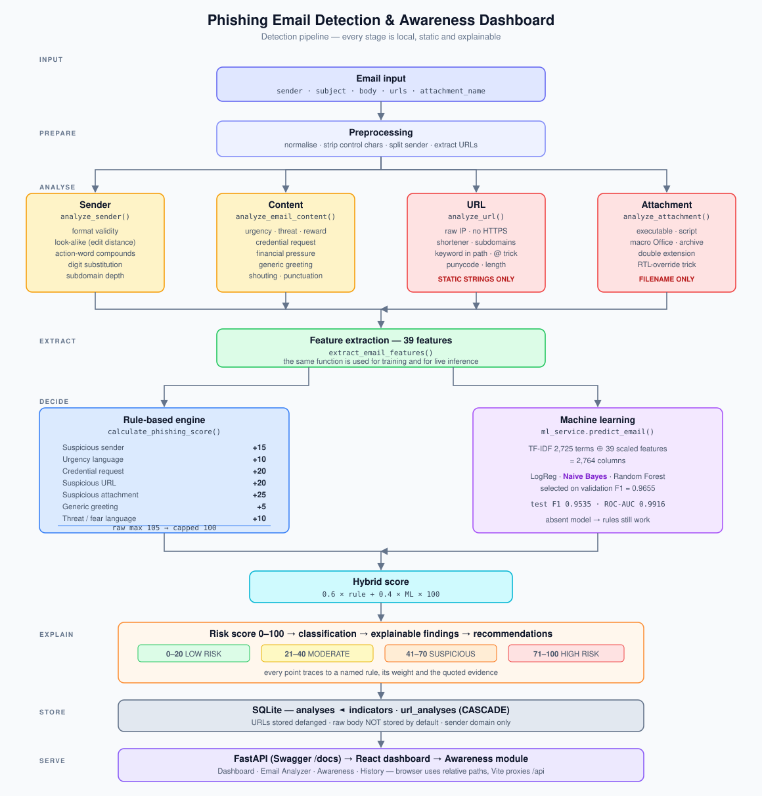

# Architecture



*Rendered diagram: [`architecture_diagram.svg`](architecture_diagram.svg). The
ASCII version below carries the same information and stays readable in a
terminal or a plain-text diff.*

## 1. The pipeline

```
┌──────────────────────────────────────────────────────────────────────────┐
│ INPUT                                                                    │
│   sender · subject · body · urls · attachment_name                       │
│   (from the dashboard form, POST /api/analyze, or ml/predict.py)         │
└────────────────────────────────┬─────────────────────────────────────────┘
                                 │
                                 ▼
┌──────────────────────────────────────────────────────────────────────────┐
│ PREPROCESSING                       backend/services/preprocessing.py    │
│   • normalise whitespace, strip control characters                       │
│   • split the sender into local-part / domain                            │
│   • extract URLs from the body when none were supplied                   │
│   • build clean_text (subject + body) for the ML model                   │
└────────────────────────────────┬─────────────────────────────────────────┘
                                 │
        ┌────────────────┬───────┴────────┬────────────────┐
        ▼                ▼                ▼                ▼
┌───────────────┐ ┌──────────────┐ ┌─────────────┐ ┌──────────────────┐
│ SENDER        │ │ CONTENT      │ │ URL         │ │ ATTACHMENT       │
│ analyze_      │ │ analyze_     │ │ analyze_    │ │ analyze_         │
│ sender()      │ │ email_       │ │ url()       │ │ attachment()     │
│               │ │ content()    │ │             │ │                  │
│ format · look-│ │ urgency ·    │ │ raw IP ·    │ │ extension ·      │
│ alike (edit   │ │ threat ·     │ │ no HTTPS ·  │ │ double extension │
│ distance) ·   │ │ credential · │ │ shortener · │ │ · executable ·   │
│ action-word   │ │ financial ·  │ │ subdomains ·│ │ script · macro   │
│ compounds ·   │ │ reward ·     │ │ keywords ·  │ │                  │
│ digit swaps · │ │ greeting ·   │ │ @ trick ·   │ │ FILENAME ONLY    │
│ subdomains    │ │ shouting     │ │ punycode    │ │ nothing is read  │
│               │ │              │ │ STATIC ONLY │ │ or executed      │
└───────┬───────┘ └──────┬───────┘ └──────┬──────┘ └────────┬─────────┘
        │                │                │                 │
        └────────────────┴────────┬───────┴─────────────────┘
                                  ▼
┌──────────────────────────────────────────────────────────────────────────┐
│ FEATURE EXTRACTION              backend/services/feature_extractor.py    │
│   extract_email_features() → 39 numeric features, fixed order            │
│   The SAME function is used for training and for inference.              │
└────────────────────────────────┬─────────────────────────────────────────┘
                                 │
              ┌──────────────────┴──────────────────┐
              ▼                                     ▼
┌───────────────────────────────┐   ┌──────────────────────────────────────┐
│ RULE ENGINE                   │   │ ML MODEL                             │
│ calculate_phishing_score()    │   │ backend/services/ml_service.py       │
│                               │   │                                      │
│ sender        +15             │   │ TF-IDF(2 725) ⊕ 39 scaled features   │
│ urgency       +10             │   │        → Naive Bayes                 │
│ credential    +20             │   │        → P(phishing)                 │
│ url           +20             │   │                                      │
│ attachment    +25             │   │ Loaded from                          │
│ greeting       +5             │   │ models/phishing_model.joblib         │
│ threat        +10             │   │ Absent → rules still work            │
│ ───────────────────           │   │                                      │
│ raw max 105 → capped 100      │   │                                      │
└──────────────┬────────────────┘   └──────────────────┬───────────────────┘
               │                                       │
               └───────────────────┬───────────────────┘
                                   ▼
                    ┌──────────────────────────────┐
                    │ HYBRID                       │
                    │ 0.6 × rule + 0.4 × ML × 100  │
                    └──────────────┬───────────────┘
                                   ▼
┌──────────────────────────────────────────────────────────────────────────┐
│ CLASSIFICATION + EXPLANATION                                             │
│   0-20 LOW · 21-40 MODERATE · 41-70 SUSPICIOUS · 71-100 HIGH RISK        │
│   why[] · indicators[] (category, severity, description, evidence,       │
│   weight) · recommendations[] (priority, action, detail)                 │
└────────────────────────────────┬─────────────────────────────────────────┘
                                 ▼
┌──────────────────────────────────────────────────────────────────────────┐
│ PERSISTENCE                     SQLite, WAL, foreign keys ON             │
│   analyses ──< indicators                                                │
│            ──< url_analyses          (ON DELETE CASCADE)                 │
│   users · schema_meta                                                    │
│   The raw body is NOT stored unless STORE_EMAIL_BODY=true                │
└────────────────────────────────┬─────────────────────────────────────────┘
                                 ▼
┌──────────────────────────────────────────────────────────────────────────┐
│ API  (FastAPI + Swagger)   →   FRONTEND  (React + Vite + Recharts)       │
│   /api/analyze · /api/analyses · /api/dashboard/* · /api/awareness       │
│   Dashboard · Email Analyzer · Awareness · History                       │
└──────────────────────────────────────────────────────────────────────────┘
```

---

## 2. Why the design looks like this

### One feature function, used twice

`extract_email_features()` is called by `ml/train_model.py` **and** by the live
API. Most "great offline metrics, useless in production" failures come from a
training script that reimplements feature logic slightly differently. Sharing
the function makes that class of bug impossible.

A consequence worth noting: `preprocess_dataframe()` adds a helper column named
`url_count`, which collides with a feature of the same name. Concatenating
without dropping it produced a duplicate column, so the saved scaler expected 40
inputs while inference supplied 39. `train_model.py` now drops colliding helper
columns and asserts the width — the assertion is what caught it.

### Rules and ML are independent

The rule engine never consults the model, and the model never sees the rule
score. Either can run alone:

- No `models/phishing_model.joblib` → the API still analyses, `ml_available`
  is `false`, and the UI says so.
- ML disabled per-request via `use_ml=False`.

This matters because the two fail differently. Rules miss what has no surface
indicators; the model misses what its training data never contained. Keeping
them separate means a failure in one is visible rather than absorbed.

### Everything is static

No analyzer opens a socket, reads a file, or executes anything. This is enforced
by tests that monkey-patch `socket.connect`, `socket.create_connection`,
`socket.gethostbyname` and `builtins.open` to raise.

### Defanging happens at the boundary

`safe_representation` (`hxxp://198[.]51[.]100[.]10/...`) is produced by the URL
analyzer, so nothing downstream — API, database or UI — ever handles a
clickable attacker URL.

---

## 3. Module map

```
backend/
  app.py                    FastAPI application, middleware, error handlers
  config.py                 Settings from .env with safe defaults
  models/
    database.py             Schema (v2), connection, migrations, init/reset
    repository.py           All SQL. Parameterised; sort columns whitelisted
    schemas.py              Pydantic request/response models
  routes/
    analyze_routes.py       POST /api/analyze, /analyze/url, /analyze/upload
    history_routes.py       GET/DELETE /api/analyses
    dashboard_routes.py     GET /api/dashboard/*
    awareness_routes.py     GET /api/awareness*
    auth_routes.py          Optional register/login/logout
  services/
    preprocessing.py        Normalisation, URL extraction, dataframe cleaning
    sender_analyzer.py      analyze_sender()
    content_analyzer.py     analyze_email_content(), analyze_subject()
    url_analyzer.py         analyze_url(), analyze_urls()      [STATIC]
    attachment_analyzer.py  analyze_attachment()               [FILENAME]
    feature_extractor.py    extract_email_features() → 39 features
    risk_engine.py          calculate_phishing_score(), bands, recommendations
    ml_service.py           Model loading, predict_email(), hybrid_score()
    analysis_service.py     Orchestrates the whole pipeline
    awareness_content.py    All training content (single source of truth)
  utils/
    keywords.py             Every lexicon and regex, with rationale comments
    text_utils.py           Phrase/pattern matching, URL extraction, defanging
    validators.py           Input validation
    security.py             PBKDF2 hashing, tokens, rate limiter
    logger.py               App and security loggers

data/generate_dataset.py    Deterministic synthetic dataset generator
ml/train_model.py           Trains 3 models, writes metrics + charts
ml/evaluation.py            Rule vs ML vs hybrid on the same test split
ml/predict.py               CLI analyser
ml/optional_bert.py         Optional DistilBERT track (never imported)
scripts/seed_demo.py        Populates the dashboard with real analyses
scripts/capture_screenshots.py  Browser evidence capture
scripts/render_terminal.py  Terminal evidence capture
tests/test_detection.py     64 tests covering the 25 required scenarios
frontend/src/               React app (4 pages, shared components, api.js)
```

---

## 4. Database schema (v2)

```sql
analyses
    analysis_id       TEXT PRIMARY KEY     -- UUID4
    sender_domain     TEXT                 -- domain only, never the full address
    subject           TEXT                 -- truncated
    risk_score        INTEGER              -- 0-100
    classification    TEXT
    risk_state        TEXT
    rule_score        INTEGER
    ml_probability    REAL                 -- NULL when no model was loaded
    hybrid_score      INTEGER
    indicator_count   INTEGER
    url_count         INTEGER
    attachment_name   TEXT
    attachment_risk   INTEGER
    sender_risk_score INTEGER
    source            TEXT                 -- 'api' | 'upload' | 'seed'
    body_stored       INTEGER              -- 0 unless STORE_EMAIL_BODY=true
    body_preview      TEXT
    created_at        TEXT                 -- ISO-8601 UTC

indicators                                  -- one row per explainable finding
    indicator_id      INTEGER PK AUTOINCREMENT
    analysis_id       TEXT → analyses  ON DELETE CASCADE
    indicator_type · category · description · severity

url_analyses                                -- one row per link
    url_analysis_id         INTEGER PK AUTOINCREMENT
    analysis_id             TEXT → analyses  ON DELETE CASCADE
    url_safe_representation TEXT             -- ALWAYS defanged
    risk_score · findings (JSON)
    hostname · is_ip · uses_https · is_shortener     -- added in v2

users                                        -- only used when auth is enabled
    user_id · username UNIQUE · password_hash · role · created_at

schema_meta
    key · value                              -- schema_version = 2
```

`PRAGMA foreign_keys = ON` and WAL journalling are set on every connection.
Seven indexes cover the dashboard's aggregate queries.

**Migrations.** SQLite has no `ADD COLUMN IF NOT EXISTS`, so `_migrate()` reads
`PRAGMA table_info` and adds only what is missing. An existing v1 database is
upgraded in place rather than requiring the user to delete it — a beginner
cannot debug "no such column".

---

## 5. Request flow: `POST /api/analyze`

```
Browser  ──POST /api/analyze──▶  Vite dev server (proxy)  ──▶  FastAPI :8000
                                                                  │
   ① Pydantic validates the body (422 on malformed input)         │
   ② Rate limiter checks the client key                           │
   ③ analysis_service.analyze_email()                             │
        preprocess → 4 analyzers → features → rules → ML → hybrid │
   ④ repository.save_analysis()  (analysis + indicators + URLs)   │
   ⑤ JSON response                                                │
Browser  ◀──────────────────────────────────────────────────────  ┘
```

The browser only ever calls **relative** paths. Vite proxies `/api` to
`http://127.0.0.1:8000`, so the app needs no CORS and keeps working when opened
from another machine — a hard-coded `127.0.0.1` in frontend code would break the
moment the browser is not on the same host as the backend.
